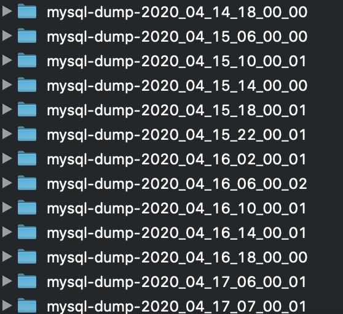

## Batch dump for MySQL and PostgreSQL databases.

This class creates dump archives for MySQL and PostgreSQL databases. You can create dumps for all databases including system, without system databases or own specific database list.

### Setup
```php
include ('src/DataBasesDumper.php');

//example for MySQL
$mysql = new DataBasesDumper();
$mysql->setDbType('mysql');
$mysql->setTargetDirectory('path_to_archive_folder');
$mysql->setConnectionData('mysql:host=host', 'user', 'password');

//example for PostgreSQL
$postgresql= new DataBasesDumper();
$postgresql->setDbType('postgresql');
$postgresql->setTargetDirectory('path_to_archive_folder');
$postgresql->setConnectionData("pgsql:dbname=db_name;host=host", 'user', 'password' );
```
------

### Create databases dump

1. Dump all databases include system.
```php
//example for MySQL
$mysql->makeDumpWithSystem();

//example for PostgreSQL
$postgresql->makeDumpWithSystem();
```

2. Dump all databases without system.
```php
//example for MySQL
$mysql->makeDumpWithoutSystem();

//example for PostgreSQL
$postgresql->makeDumpWithoutSystem();
```
3. Custom list of databases
```php
//example for MySQL
$mysql->setMyDBList(['db1', 'db2']);
$mysql->makeDumpMyDbList()

//example for PostgreSQL
$postgresql->setMyDBList(['db1', 'db2']);
$postgresql->makeDumpMyDbList()
```
---
### Output
In folder defined in method `setTargetDirectory` will be created new folder with database type and date/time of dump making and inside compressed achives of   databases.



---
### Archives handling 
In order to keep archives only for specific period of time use method `keepArchiveNotOlderThan()` like:
```php
//example for MySQL
$mysql->keepArchiveNotOlderThan('14 days');

//example for PostgreSQL
$postgresql->keepArchiveNotOlderThan('6 months');
```

---
### Notice
Class require symlinks for `mysqldump` and/or `pg_dump` in folder `/usr/local/bin/`
